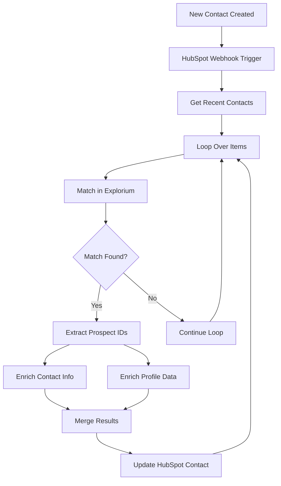

## Template

Download the following json file and import it to a new n8n workflow:

<Columns cols={2}>
<Card size={22} icon="rocket-launch" horizontal title="hubspot_flow.json" href="https://drive.usercontent.google.com/u/0/uc?id=1jbXjAIWEcyQoAAZQNQVLgoKw5jC-gF2h&export=download" />
</Columns>


<Frame>

</Frame>

## Overview

This n8n workflow monitors your HubSpot instance for newly created contacts and automatically enriches them with additional contact information. When a contact is created, the workflow:

<Steps>
    <Step>
    Detects the new contact via HubSpot webhook trigger
    </Step>
    <Step>
    Retrieves recent contact details from HubSpot
    </Step>
    <Step>
    Matches the contact against Explorium's database using name, company, and email
    </Step>
    <Step>
    Enriches the contact with professional emails and phone numbers
    </Step>
    <Step>
    Updates the HubSpot contact record with discovered information
    </Step>
</Steps>

This automation ensures your sales and marketing teams have complete contact information, improving outreach success rates and data quality.


## Key Features

- **Real-time Webhook Trigger**: Instantly processes new contacts as they're created
- **Intelligent Matching**: Uses multiple data points (name, company, email) for accurate matching
- **Comprehensive Enrichment**: Adds both professional and work emails, plus phone numbers
- **Batch Processing**: Efficiently handles multiple contacts to optimize API usage
- **Smart Data Mapping**: Intelligently maps multiple emails and phone numbers
- **Profile Enrichment**: Optional additional enrichment for deeper contact insights
- **Error Resilience**: Continues processing other contacts if some fail to match


## Prerequisites

Before setting up this workflow, ensure you have:

1. **n8n instance** (self-hosted or cloud)
2. **HubSpot account** with:
	- Developer API access (for webhooks)
	- Private App or OAuth2 app created
	- Contact object permissions (read/write)
3. **Explorium API credentials** (API Key)
4. Understanding of HubSpot contact properties


## HubSpot Requirements

### Required Contact Properties

The workflow uses these HubSpot contact properties:

- `firstname` - Contact's first name
- `lastname` - Contact's last name
- `company` - Associated company name
- `email` - Primary email (read and updated)
- `work_email` - Work email (updated by workflow)
- `phone` - Phone number (updated by workflow)


### API Access Setup

<Steps>
    <Step title="Create a Private App in HubSpot">
    **Create a Private App** in HubSpot:
	- Navigate to Settings <Icon icon="arrow-right" /> Integrations <Icon icon="arrow-right" /> Private Apps
	- Create new app with Contact read/write scopes
	- Copy the Access Token
    </Step>
    <Step title="Set up Webhooks (for Developer API)">
    **Set up Webhooks** (for Developer API):
	- Create app in HubSpot Developers portal
	- Configure webhook for contact.creation events
	- Note the App ID and Developer API Key
    </Step>
</Steps>


### Custom Properties (Optional)

Consider creating custom properties for:

- Multiple email addresses
- Mobile vs. office phone numbers
- Data enrichment timestamps
- Match confidence scores


## Installation & Setup

### Step 1: Import the Workflow

<Steps>
    <Step>
    Create a new workflow.
    </Step>

    <Step>
    Download the workflow JSON from above.
    </Step>

    <Step>
    In your n8n instance, go to **Workflows** <Icon icon="arrow-right" /> **Add Workflow** <Icon icon="arrow-right" /> **Import from File**
    </Step>

    <Step>
    Select the JSON file and click **Import**
    </Step>
</Steps>


### Step 2: Configure HubSpot Developer API (Webhook)

<Steps>
    <Step>
    Click on the **HubSpot Trigger** node
    </Step>
    <Step>
    Under Credentials, click **Create New**
    </Step>

    <Step>
    Enter your HubSpot Developer credentials:
	- **App ID**: From your HubSpot app
	- **Developer API Key**: From your developer account
	- **Client Secret**: From your app settings
    </Step>
    <Step>
    Save as "HubSpot Developer account"
    </Step>
</Steps>


### Step 3: Configure HubSpot App Token

<Steps>
    <Step>
    Click on the **HubSpot Recently Created** node
    </Step>
    <Step>
    Under Credentials, click **Create New** (App Token)
    </Step>

    <Step>
    Enter your Private App access token
    </Step>

    <Step>
    Save as "HubSpot App Token account"
    </Step>

    <Step>
    Apply the same credentials to the **Update HubSpot** node
    </Step>
</Steps>


### Step 4: Configure Explorium API Credentials

<Steps>
<Step>
Click on the **Explorium Match Prospects** node
</Step>
<Step>
Under Credentials, click **Create New** (HTTP Header Auth)
</Step>

<Step>
Configure the authentication:
	- **Name**: `api_key`
	- **Value**: `YOUR_EXPLORIUM_API_TOKEN`
</Step>

<Step>
Save as "Header Auth Connection"

<Frame>

</Frame>
</Step>

<Step>
Apply to all Explorium nodes:
	1. Explorium Enrich Contacts Information
	2. Explorium Enrich Profiles
</Step>
</Steps>


### Step 5: Configure Webhook Subscription

<Steps>
<Step>
In HubSpot Developers portal:
	- Go to your app's webhook settings
	- Add subscription for `contact.creation` events
	- Set the target URL from the HubSpot Trigger node
	- Activate the subscription

</Step>
</Steps>


### Step 6: Activate the Workflow

<Steps>
    <Step>
    Save the workflow
    </Step>
    <Step>
    Toggle the **Active** switch to ON
    </Step>

    <Step>
    The webhook is now listening for new contacts
    </Step>
</Steps>


## How It Works

### Workflow Process Flow




### Node Descriptions

1. **HubSpot Trigger**: Webhook that fires when new contacts are created
2. **HubSpot Recently Created**: Fetches details of recently created contacts
3. **Loop Over Items**: Processes contacts in batches of 6
4. **Explorium Match Prospects**: Finds matching person in Explorium database
5. **Filter**: Validates successful matches
6. **Extract Prospect IDs**: Collects matched prospect identifiers
7. **Enrich Contacts Information**: Fetches emails and phone numbers
8. **Enrich Profiles**: Gets additional profile data (optional)
9. **Merge**: Combines all enrichment results
10. **Split Out**: Separates individual enriched records
11. **Update HubSpot**: Updates contact with new information


### Data Mapping Logic

The workflow maps Explorium data to HubSpot properties:

| Explorium Data | HubSpot Property | Notes |
| :--- | :--- | :--- |
| `professions_email` | `email` | Primary professional email |
| `emails[].address` | `work_email` | All email addresses joined |
| `phone_numbers[].phone_number` | `phone` | All phones joined with commas |
| `mobile_phone` | `phone` (fallback) | Used if no other phones found |


### Data Processing

The workflow handles complex data scenarios:

- **Multiple emails**: Joins all discovered emails with commas
- **Phone numbers**: Combines all phone numbers into a single field
- **Missing data**: Uses "null" as placeholder for empty fields
- **Name parsing**: Cleans sample data and special characters


## Usage & Operation

### Automatic Processing

Once activated:

<Steps>
    <Step>
    Every new contact triggers the webhook immediately
    </Step>
    <Step>
    Contact is enriched within seconds
    </Step>
    <Step>
    HubSpot record is updated automatically
    </Step>
    <Step>
    Process repeats for each new contact
    </Step>
</Steps>


### Manual Testing

To test the workflow:

<Steps>
    <Step>
    Use the pinned test data in the HubSpot Trigger node, or
    </Step>
    <Step>
    Create a test contact in HubSpot
    </Step>
    <Step>
    Monitor the execution in n8n
    </Step>
    <Step>
    Verify the contact was updated in HubSpot
    </Step>
</Steps>


### Monitoring Performance

Track workflow health:

<Steps>
    <Step>
    Go to **Executions** in n8n
    </Step>
    <Step>
    Filter by this workflow
    </Step>
    <Step>
    Monitor success rates
    </Step>
    <Step>
    Review any failed executions
    </Step>
    <Step>
    Check webhook delivery in HubSpot
    </Step>
</Steps>


## Troubleshooting

### Common Issues

**Webhook not triggering**

- Verify webhook subscription is active in HubSpot
- Check the webhook URL is correct and accessible
- Ensure workflow is activated in n8n
- Test webhook delivery in HubSpot developers portal

**Contacts not matching**

- Verify contact has firstname, lastname, and company
- Check for typos or abbreviations in company names
- Some individuals may not be in Explorium's database
- Email matching improves accuracy significantly

**Updates failing in HubSpot**

- Check API token has contact write permissions
- Verify property names exist in HubSpot
- Ensure rate limits haven't been exceeded
- Check for validation rules on properties

**Missing enrichment data**

- Not all prospects have all data types
- Phone numbers may be less available than emails
- Profile enrichment is optional and may not always return data


Error HandlingBuilt-in error resilience:

- Failed matches don't block other contacts
- Each batch processes independently
- Partial enrichment is possible
- All errors are logged for review


Debugging Tips

1. **Check webhook logs**: HubSpot shows delivery attempts
2. **Review executions**: n8n logs show detailed error messages
3. **Test with pinned data**: Use the sample data for isolated testing
4. **Verify API responses**: Check Explorium API returns expected data


## Best Practices

### Data Quality

1. **Complete contact records**: Ensure name and company are populated
2. **Standardize company names**: Use official names, not abbreviations
3. **Include existing emails**: Improves match accuracy
4. **Regular data hygiene**: Clean up test and invalid contacts


### Performance Optimization

1. **Batch size**: 6 is optimal for rate limits
2. **Webhook reliability**: Monitor delivery success
3. **API quotas**: Track usage in both platforms
4. **Execution history**: Regularly clean old executions


### Compliance & Privacy

1. **GDPR compliance**: Ensure lawful basis for enrichment
2. **Data minimization**: Only enrich necessary fields
3. **Access controls**: Limit who can modify enriched data
4. **Audit trail**: Document enrichment for compliance


## Customization Options

### Additional Enrichment

Extend with more Explorium data:

- Job titles and departments
- Social media profiles
- Professional experience
- Skills and interests
- Company information


### Enhanced Processing

Add workflow logic for:

- Lead scoring based on enrichment
- Routing based on data quality
- Notifications for high-value matches
- Custom field mapping


Integration ExtensionsConnect to other systems:

- Sync enriched data to CRM
- Trigger marketing automation
- Update data warehouse
- Send notifications to Slack


## API Considerations

### HubSpot Limits

- **API calls**: Monitor daily limits
- **Webhook payload**: Max 200 contacts per trigger
- **Rate limits**: 100 requests per 10 seconds
- **Property limits**: Max 1000 custom properties


### Explorium Limits

- **Match API**: Batched for efficiency
- **Enrichment calls**: Two parallel enrichments
- **Rate limits**: Based on your plan
- **Data freshness**: Real-time matching


### Architecture Considerations

This workflow integrates with:

- HubSpot workflows and automation
- Marketing campaigns and sequences
- Sales engagement tools
- Reporting and analytics
- Other enrichment services


### Security Best Practices

- **Webhook validation**: Verify requests are from HubSpot
- **Token security**: Rotate API tokens regularly
- **Access control**: Limit workflow modifications
- **Data encryption**: All API calls use HTTPS
- **Audit logging**: Track all enrichments


## Advanced Configuration

### Custom Field Mapping

Modify the Update HubSpot node to map to custom properties:

```javascript JavaScript
// Example custom mapping
{
  "custom_mobile": "{{ $json.data.mobile_phone }}",
  "custom_linkedin": "{{ $json.data.linkedin_url }}",
  "enrichment_date": "{{ $now.toISO() }}"
}
```


### Conditional Processing

Add logic to process only certain contacts:

- Filter by contact source
- Check for specific properties
- Validate email domains
- Exclude test contacts


## Support Resources

For assistance:

- **n8n issues**: Check n8n documentation and forums
- **HubSpot API**: Reference HubSpot developers documentation
- **Explorium API**: Contact Explorium support
- **Webhook issues**: Use HubSpot webhook testing tools

