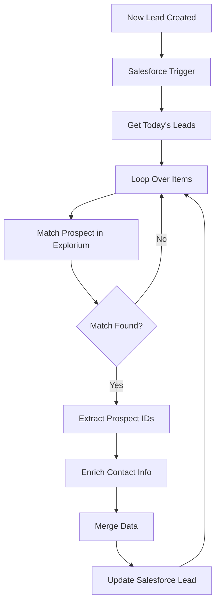

## Template

Download the following json file and import it to a new n8n workflow:

<Columns cols={2}>
<Card size={22} icon="rocket-launch" horizontal title="salesforce_Workflow.json" href="https://drive.usercontent.google.com/u/0/uc?id=1iEv-pVFomUka59u7d0dpaapKb4uFO1fh&export=download" />
</Columns>

<Frame>

</Frame>

## Overview

This n8n workflow monitors your Salesforce instance for new leads and automatically enriches them with missing contact information. When a lead is created, the workflow:

1. Detects the new lead via Salesforce trigger
2. Matches the lead against Explorium's database using name and company
3. Enriches the lead with professional email addresses and phone numbers
4. Updates the Salesforce lead record with the discovered contact information

This automation ensures your sales team always has the most up-to-date contact information for new leads, improving reach rates and accelerating the sales process.

## Key Features

- **Real-time Processing**: Triggers automatically when new leads are created in Salesforce
- **Intelligent Matching**: Uses lead name and company to find the correct person in Explorium's database
- **Contact Enrichment**: Adds professional emails, mobile phones, and office phone numbers
- **Batch Processing**: Efficiently handles multiple leads to optimize API usage
- **Error Handling**: Continues processing other leads even if some fail to match
- **Selective Updates**: Only updates leads that successfully match in Explorium

## Prerequisites

Before setting up this workflow, ensure you have:

1. **n8n instance** (self-hosted or cloud)
2. **Salesforce account** with:
	- OAuth2 API access enabled
	- Lead object permissions (read/write)
	- API usage limits available
3. **Explorium API credentials** (API Key)
4. Basic understanding of Salesforce lead management

## Salesforce Requirements

### Required Lead Fields

The workflow expects these standard Salesforce lead fields:

- `FirstName` - Lead's first name
- `LastName` - Lead's last name
- `Company` - Company name
- `Email` - Will be populated/updated by the workflow
- `Phone` - Will be populated/updated by the workflow
- `MobilePhone` - Will be populated/updated by the workflow

### API Permissions

Your Salesforce integration user needs:

- Read access to Lead object
- Write access to Lead object fields (Email, Phone, MobilePhone)
- API enabled on the user profile
- Sufficient API calls remaining in your org limits

## Installation & Setup

### Step 1: Import the Workflow

<Steps>
<Step>
Create a new workflow.
</Step>
<Step>
Download the workflow JSON from above.
</Step>

<Step>
In your n8n instance, go to **Workflows** <Icon icon="arrow-right" /> **Add Workflow** <Icon icon="arrow-right" /> **Import from File**
</Step>

<Step>
Select the JSON file and click **Import**
</Step>
</Steps>

### Step 2: Configure Salesforce OAuth2 Credentials

<Steps>
<Step>
Click on the **Salesforce Trigger** node
</Step>
<Step>
Under Credentials, click **Create New**
</Step>

<Step>
Follow the OAuth2 flow:
	- **Client ID**: From your Salesforce Connected App
	- **Client Secret**: From your Salesforce Connected App
	- **Callback URL**: Copy from n8n and add to your Connected App
</Step>

<Step>
Authorize the connection
</Step>

<Step>
Save the credentials as "Salesforce account connection"
</Step>
</Steps>

**Note**: Use the same credentials for all Salesforce nodes in the workflow.

### Step 3: Configure Explorium API Credentials

<Steps>
<Step>
Click on the **Match\_prospect** node
</Step>
<Step>
Under Credentials, click **Create New** (HTTP Header Auth)
</Step>

<Step>
Configure the header:
	- **Name**: `api_key`
	- **Value**: `YOUR_EXPLORIUM_API_TOKEN`
</Step>

<Step>
Save as "Header Auth account"

<Frame>

</Frame>
</Step>

<Step>
Apply the same credentials to the **Explorium Enrich Contacts Information** node
</Step>
</Steps>

### Step 4: Verify Node Settings

<Steps>
<Step title="Salesforce Trigger">
	- Trigger On: `Lead Created`
	- Poll Time: Every minute (adjust based on your needs)
</Step>
<Step title="Salesforce Get Leads">
	- Operation: `Get All`
	- Condition: `CreatedDate = TODAY` (fetches today's leads)
	- Limit: 20 (adjust based on volume)
</Step>
<Step title="Loop Over Items">
	- Batch Size: 6 (optimal for API rate limits)
</Step>
</Steps>

### Step 5: Activate the Workflow

<Steps>
<Step>
Save the workflow
</Step>
<Step>
Toggle the **Active** switch to ON
</Step>

<Step>
The workflow will now monitor for new leads every minute
</Step>
</Steps>

## How It Works

### Workflow Process Flow

### Detailed Node Descriptions

1. **Salesforce Trigger**: Polls Salesforce every minute for new leads
2. **Get Today's Leads**: Retrieves all leads created today to ensure none are missed
3. **Loop Over Items**: Processes leads in batches of 6 for efficiency
4. **Match Prospect**: Searches Explorium for matching person using name + company
5. **Filter**: Checks if a valid match was found
6. **Extract Prospect IDs**: Collects all matched prospect IDs
7. **Enrich Contacts**: Fetches detailed contact information from Explorium
8. **Merge**: Combines original lead data with enrichment results
9. **Split Out**: Separates individual enriched records
10. **Update Lead**: Updates Salesforce with new contact information

### Data Mapping

The workflow maps Explorium data to Salesforce fields as follows:

| Explorium Field | Salesforce Field | Fallback Logic |
| :--- | :--- | :--- |
| `emails[0].address` | Email | Falls back to `professions_email` |
| `mobile_phone` | MobilePhone | Falls back to `phone_numbers[1]` |
| `phone_numbers[0]` | Phone | Falls back to `mobile_phone` |

## Usage & Monitoring

### Automatic Operation

Once activated, the workflow runs automatically:

<Steps>
    <Step>
    Checks for new leads every minute
    </Step>
    <Step>
    Processes any leads created since the last check
    </Step>
    <Step>
    Updates leads with discovered contact information
    </Step>
    <Step>
    Continues running until deactivated
    </Step>
</Steps>

### Manual Testing

To test the workflow manually:

<Steps>
<Step>
Create a test lead in Salesforce
</Step>
<Step>
Click "Execute Workflow" in n8n
</Step>
<Step>
Monitor the execution to see each step
</Step>
<Step>
Verify the lead was updated in Salesforce
</Step>
</Steps>

### Monitoring Executions

Track workflow performance:

<Steps>
    <Step>
    Go to **Executions** in n8n
    </Step>
    <Step>
    Filter by this workflow
    </Step>
    <Step>
    Review successful and failed executions
    </Step>
    <Step>
    Check logs for any errors or issues
    </Step>
</Steps>

## Troubleshooting

### Common Issues

**No leads are being processed**

- Verify the workflow is activated
- Check Salesforce API limits haven't been exceeded
- Ensure new leads have FirstName, LastName, and Company populated
- Confirm OAuth connection is still valid

**Leads not matching in Explorium**

- Verify company names are accurate (not abbreviations)
- Check that first and last names are properly formatted
- Some individuals may not be in Explorium's database
- Try testing with known companies/contacts

**Contact information not updating**

- Check Salesforce field-level security
- Verify the integration user has edit permissions
- Ensure Email, Phone, and MobilePhone fields are writeable
- Check for validation rules blocking updates

**Authentication errors**

- Salesforce: Re-authorize OAuth connection
- Explorium: Verify Bearer token is valid and not expired
- Check API quotas haven't been exceeded

### Error Handling

The workflow includes built-in error handling:

- Failed matches don't stop other leads from processing
- Each batch is processed independently
- Failed executions are logged for review
- Partial successes are possible (some leads updated, others skipped)

## Best Practices

### Data Quality

1. **Ensure complete lead data**: FirstName, LastName, and Company should be populated
2. **Use full company names**: "Microsoft Corporation" matches better than "MSFT"
3. **Standardize data entry**: Consistent formatting improves match rates

### Performance Optimization

<Steps>
<Step title="Adjust batch size">
Lower if hitting API limits, higher for efficiency
</Step>
<Step title="Modify polling frequency">
Every minute for high volume, less frequent for lower volume
</Step>
<Step title="Set appropriate limits">
Balance between processing speed and API usage
</Step>
</Steps>

### Compliance & Privacy

1. **Data permissions**: Ensure you have rights to enrich lead data
2. **GDPR compliance**: Consider privacy regulations in your region
3. **Data retention**: Follow your organization's data policies
4. **Audit trail**: Monitor who has access to enriched data

## Customization Options

### Extend the Enrichment

Add more Explorium enrichment by:

1. Adding firmographic data (company size, revenue)
2. Including technographic information
3. Appending social media profiles
4. Adding job title and department verification

### Modify Trigger Conditions

Change when enrichment occurs:

- Trigger on lead updates (not just creation)
- Add specific lead source filters
- Process only leads from certain campaigns
- Include lead score thresholds

### Add Notifications

Enhance with alerts:

- Email sales reps when leads are enriched
- Send Slack notifications for high-value matches
- Create tasks for leads that couldn't be enriched
- Log enrichment metrics to dashboards

## API Considerations

### Salesforce Limits

- API calls: Each execution uses ~4 Salesforce API calls
- Polling frequency: Consider your daily API limit
- Batch processing: Reduces API usage vs. individual processing

### Explorium Limits

- Match API: One call per batch of leads
- Enrichment API: One call per batch of matched prospects
- Rate limits: Respect your plan's requests per minute

### Integration Architecture

This workflow can be part of a larger lead management system:

1. **Lead Capture** <Icon icon="arrow-right" /> **This Workflow** <Icon icon="arrow-right" /> **Lead Scoring** <Icon icon="arrow-right" /> **Assignment**
2. Can trigger additional workflows based on enrichment results
3. Compatible with existing Salesforce automation (Process Builder, Flows)
4. Works alongside other enrichment tools

### Security Considerations

- **Credentials**: Stored securely in n8n's credential system
- **Data transmission**: Uses HTTPS for all API calls
- **Access control**: Limit who can modify the workflow
- **Audit logging**: All executions are logged with details

### Support Resources

For assistance with:

- **n8n issues**: Consult n8n documentation or community forum
- **Salesforce integration**: Reference Salesforce API documentation
- **Explorium API**: Contact Explorium support for API questions
- **Workflow logic**: Review execution logs for debugging

